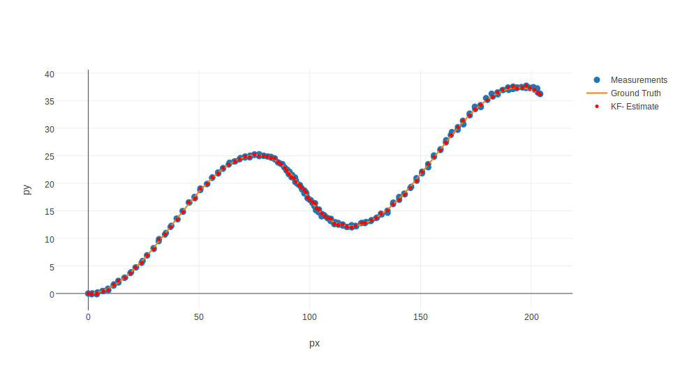

# Unscented Kalman Filter Project Starter Code
Self-Driving Car Engineer Nanodegree Program

---

## Implementation of UKF
It was straight forward implementation after Udacity classes
More complex was to tune parameters for process noise.
While it was easy to tune parameters for each separate input,
it was more complex to find values that would satisfy both
at the same time.

Previously I studied AI for Robotics class and it included
Twiddle function in one of the lessons for parameter tuning.

Using twiddle it was very easy to find parameters for each of the inputs.
Finding parameters for both functions required some tweaking
of the twiddle parameters (initial values and step size).

Here are the plots for Ground Truth, Measurements and UKF Estimate
For Input-1:

And Input-2:

UKF Estimates are accurately following path, without significant
deviations in the corners.

### NIS - Normalized Innovation Squared
Here are the NIS values plotted for both inputs.
95% of NIS values should be:
For Lidar - below 5.991
For Radar - below 7.815

For Input-1:

Here it is possible to see that more than 5% values are above the 6-8 value line. Which means that uncertainty is underestimates.

And Input-2:

Here it is possible to see that less than 5% values are above the 6-8 value line. Which means that uncertainty is overestimated.

Underestimation or overestimation - this is possibly the cause why it was difficult to find single values for the inputs provided. This solution is middle ground between under- and over- estimation.

If process noise would be setup separately for each of the inputs then more accurate results can be achieved due to parameter tuning.

## Conclusion
UKF project was very interesting as good accuracy can be achieved with relatively simple calculations.
Looking forward to use it for multiple objects and closer to real world scenarios.

## Original description
## Dependencies

* cmake >= v3.5
* make >= v4.1
* gcc/g++ >= v5.4

## Basic Build Instructions

1. Clone this repo.
2. Make a build directory: `mkdir build && cd build`
3. Compile: `cmake .. && make`
4. Run it: `./UnscentedKF path/to/input.txt path/to/output.txt`. You can find
   some sample inputs in 'data/'.
    - eg. `./UnscentedKF ../data/sample-laser-radar-measurement-data-1.txt output.txt`
